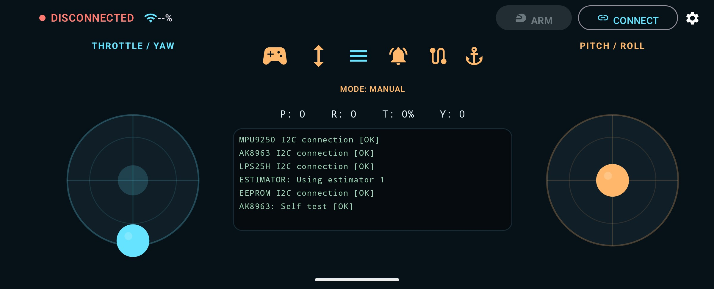

# Drone Controller

Native Android landscape controller for an ESP32 flight controller over
a local WiFi WebSocket.

## UI

The controller UI provides a landscape flight-control interface with
virtual joysticks, connection status, ARM control, telemetry, flight
mode, and flight-controller status information.

## Android app

Open `android-drone-controller` in Android Studio and run the `app`
configuration on an Android device. The project uses Kotlin, Jetpack
Compose, OkHttp WebSockets, Kotlin serialization, and Preferences
DataStore.

The first launch defaults to:

-   Host: `192.168.4.1`
-   Port: `81`
-   URL: `ws://192.168.4.1:81/`

The app locks the activity to landscape, keeps the display awake while
foregrounded, and shows a guarded landscape-only surface if the system
briefly reports portrait. The ARM control is disabled until a WebSocket
is connected. Control frames are sent at 20 Hz, with a one-second
telemetry timeout failsafe.

## ESP32 firmware

`esp32/DroneFlightController.ino` is an Arduino sketch.
`esp32/platformio.ini` provides the matching PlatformIO environment.

Install these libraries:

-   `ESPAsyncWebServer`
-   `AsyncTCP`
-   `ArduinoJson`

Set `WIFI_SSID` and `WIFI_PASSWORD` in the sketch, flash it, and connect
the Android app to the ESP32's assigned IP. The WebSocket endpoint is
port `81` at `/`.

The `applyControlToFlightController()` function is deliberately the
hardware boundary: replace its comments with the real PWM/flight-stack
mapping for the specific airframe. The network safety behavior remains
independent of that mapping.